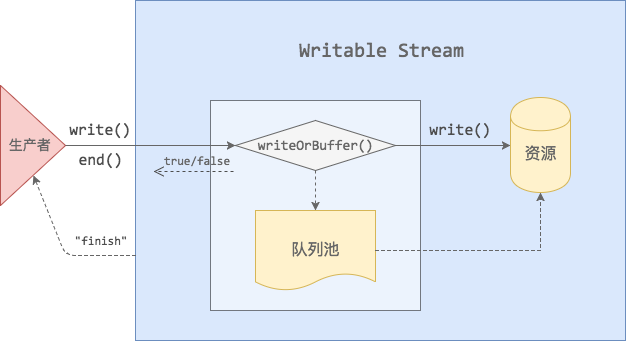
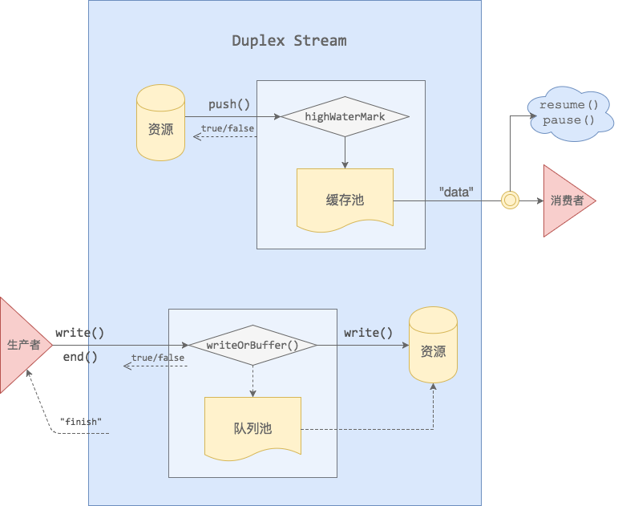
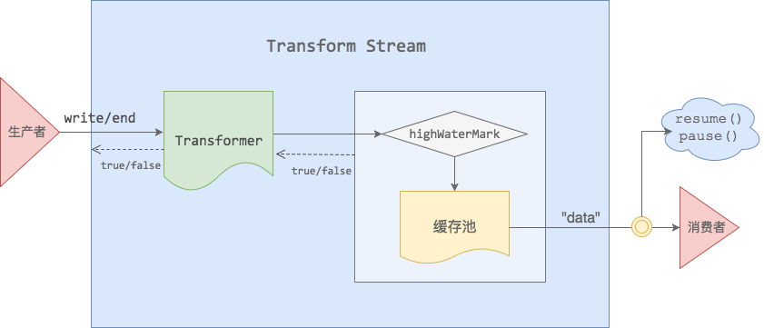

# Node-Stream-Demo

Introduction of 4 kinds of Node Stream.

Document: <https://www.barretlee.com/blog/2017/06/06/dive-to-nodejs-at-stream-module/> (in Chinese)

**1. Readable**

**2. Writable**

**3. Duplex**

**4. Transform**

